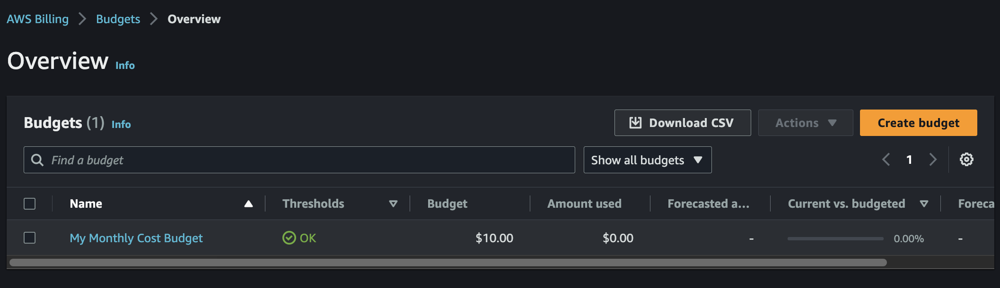

# Week 0 — Billing and Architecture

## Table of Contents
- [Installing AWS CLI](#installing-aws-cli)
- [Setting Up AWS Billing](#setting-up-aws-billing)
    - [AWS Budgets](#aws-budgets)
    - [Billing Alarms](#billing-alarms)
    - [Cost Explorer](#cost-explorer)
- [AWS Organisations](#aws-organisations)
    - [Organisational Units](#organisational-units)
- [AWS Well Architected Tool](#aws-well-architected-tool)
- [Created Cruddur LucidChart](#created-cruddur-lucidchart)

## Installing AWS CLI
Bash script written to automate AWS CLI installation using `.gitpod.yml` file.

Generated access keys within AWS Console to pass AWS credentials as Environment Variables (Env Vars) so they persist for each new gitpod workspace. Aswell as providing the means to interface with the AWS API services.

## Setting Up AWS Billing

`AWS Budgets` and `Billing Alarms` can be used to manage spend within AWS. Allowing for notifications to be sent regarded your AWS infrastructure usage spend.

### AWS Budgets

Added a budget in AWS using Console. Monthly Budget of $10 set:

We can edit the budget and creating it by selecting the box to the left of the budget and using the `actions` dropdown to select `edit`.
From here we can adjust the threshold alerts to be notified when a given percentage of spend is reached.

### Billing Alarms

AWS Billing Alarms are a cost monitoring and alerting feature. These alarms allow us to set up thresholds and notifications based on their AWS spending.

### Cost Explorer

AWS Cost Explorer is a cost analysis tool provided that allows users to visualize and understand their AWS spending patterns. It offers insights into past, present, and projected AWS costs, helping users make informed decisions to optimize their cloud expenses.

## AWS Organisations
`AWS Organisations` is an account management services which allow you to consolidate multiple AWS accounts under a single organisation manangement account. These Organisations provide benefits, such as account management and `consolidated billing capabilities` to meet budget, security and compliance needs of a business or project.

As Organisation Admin, you can create member account within the organisation or invite existing accounts to join organisation.

[Introduction to Organisations](https://docs.aws.amazon.com/organizations/latest/userguide/orgs_introduction.html)

### Organisational Units
Created `Organisational Units` called `Active-Accounts` and `Standby-Accounts` , which may be of use later in the project to organise components:

## AWS Well Architected Tool
The `AWS Well Architected Tool` is guided by a framework that helps us better implement secure, high performing, resilient and efficient infrastructure for our applications and workloads.

Pillar Priority:
1. Operational Excellence
1. Security
1. Reliability
1. Performance Efficiency
1. Cost Optimization
1. Sustainability

Example of a question asked within the operational excellence pillar of the AWS Well Architected Tool:

**NOTE:** I will continue to learn about the tool and attempt to use it through the project.

## Created Cruddur LucidChart
.

